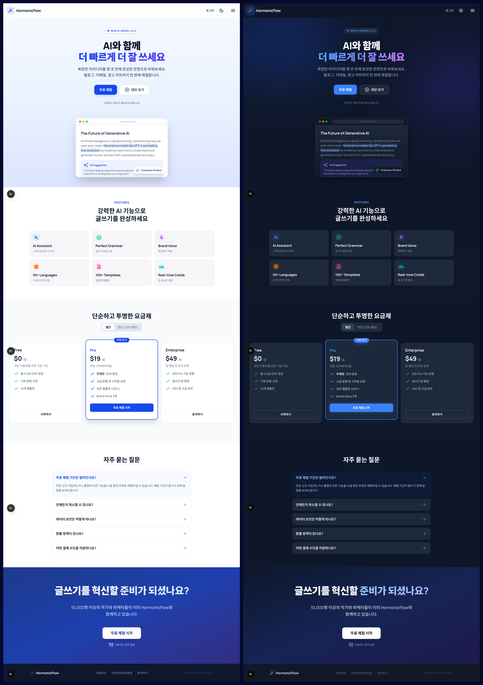

# HormonicFlow — AI Writing SaaS Landing Page

<p align="center">
  
  
  
  
  
</p>

<p align="center">
  AI 글쓰기 SaaS 서비스를 위한 반응형 랜딩 페이지 — 라이트/다크 모드 완벽 지원
</p>

---

## 📸 Preview



---

## ✨ 주요 기능

### 🎨 라이트 / 다크 모드 토글
- 헤더의 토글 버튼으로 즉시 전환
- `next-themes` 기반, 기본값은 라이트 모드
- 모드별로 완전히 분리된 디자인 시스템 적용
  - **라이트**: 흰색 배경, 파란 그래디언트 Hero
  - **다크**: `#0f172a` 딥 네이비 배경, Glow 조명 효과

### 📐 반응형 레이아웃
- 모바일 / 태블릿 / 데스크톱 최적화
- 가격 섹션: 좁은 화면에서 횡스크롤 + **마우스 드래그 스크롤** 지원
  - 모멘텀(관성) 효과로 자연스러운 UX
  - `scroll-snap` 자동 복원

### 🧩 컴포넌트 구성
| 컴포넌트 | 설명 |
|---------|------|
| `Header` | 로고, 로그인 버튼, 라이트/다크 토글, 메뉴 |
| `Hero` | 헤드라인, CTA 버튼, AI 대시보드 목업 |
| `Features` | 6가지 핵심 기능 카드 그리드 |
| `Pricing` | Free / Pro / Enterprise 요금제 비교 |
| `FAQ` | 자주 묻는 질문 아코디언 |
| `CtaSection` | 전환 유도 섹션 |
| `Footer` | 링크 및 저작권 |

---

## 🛠 기술 스택

| 분류 | 기술 |
|------|------|
| 디자인 | Stitch |
| 프레임워크 | Next.js 16 (App Router) |
| UI 라이브러리 | React 19 |
| 스타일링 | Tailwind CSS v4 |
| 언어 | TypeScript |
| 테마 관리 | next-themes |
| 폰트 | Manrope, Noto Sans KR (Google Fonts) |
| 아이콘 | Material Symbols Outlined |

---

## 📁 프로젝트 구조

```
saas-landing-page/
├── app/
│   ├── components/
│   │   ├── Header.tsx        # 헤더 + ThemeToggle
│   │   ├── ThemeProvider.tsx # next-themes 래퍼
│   │   ├── ThemeToggle.tsx   # 라이트/다크 토글 버튼
│   │   ├── Hero.tsx
│   │   ├── Features.tsx
│   │   ├── Pricing.tsx       # 드래그 스크롤 포함
│   │   ├── Faq.tsx
│   │   ├── CtaSection.tsx
│   │   └── Footer.tsx
│   ├── globals.css           # Tailwind @theme 변수
│   ├── layout.tsx
│   └── page.tsx
└── design/
    ├── light-mode-code.html  # 라이트 모드 디자인 명세
    └── dark-mode-code.html   # 다크 모드 디자인 명세
```

---

## 🚀 로컬 실행

```bash
# 패키지 설치
npm install

# 개발 서버 실행
npm run dev
```

브라우저에서 [http://localhost:3000](http://localhost:3000) 접속

---

## 💡 구현 포인트

- **다크 모드 색상 분리**: `primary` 색상을 라이트(`#1349ec`) / 다크(`#3b82f6`)로 모드별 적용
- **CSS 변수 기반 테마**: `@theme` 블록으로 `background-dark`, `surface-dark`, `surface-darker` 정의
- **모멘텀 스크롤**: `useRef` + `requestAnimationFrame`으로 리렌더링 없는 고성능 관성 스크롤 구현
- **Hydration 안전**: `suppressHydrationWarning` + `mounted` 패턴으로 SSR/CSR 불일치 방지
